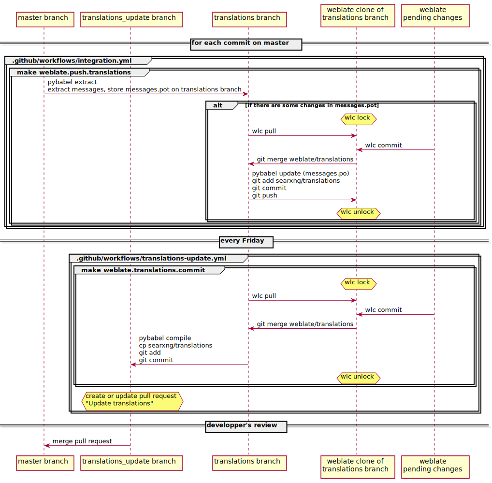

.. _translation:

===========
Translation
===========

.. _weblate.bubu1.eu: https://weblate.bubu1.eu/projects/searxng/

Translation takes place on `weblate.bubu1.eu`_ ( `documentation <https://docs.weblate.org/en/latest/index.html>`_ ).

New messages on the master branch are extracted and pushed to Weblate automatically.

Every Friday, a GitHub workflow creates a pull request with the updated translations (messages.mo, messages.po, messages.mo files).

.. image:: https://weblate.bubu1.eu/widgets/searxng/-/searxng/svg-badge.svg
   :target: https://weblate.bubu1.eu/projects/searxng/

Weblate integration
===================

Weblate monitors the `translations branch <https://github.com/searxng/searxng/tree/translations>`_, not the master branch.

This branch contains only the .pot and pot files, nothing else.

Documentation
-------------

* `wlc <https://docs.weblate.org/en/latest/wlc.html>`_
* `pybabel <http://babel.pocoo.org/en/latest/cmdline.html>`_
* `weblate workflow <https://docs.weblate.org/en/latest/workflows.html>`_

Worfklow
--------

wlc
---

All weblate integration is done by GitHub workflows, but if you want to use wlc, copy this content into `~/.config/weblate <https://docs.weblate.org/en/latest/wlc.html#wlc-config>`_ :

.. code-block:: ini

  [keys]
  https://weblate.bubu1.eu/api/ = APIKEY

Replace `APIKEY` by `your API key <https://weblate.bubu1.eu/accounts/profile/#api>`_.
